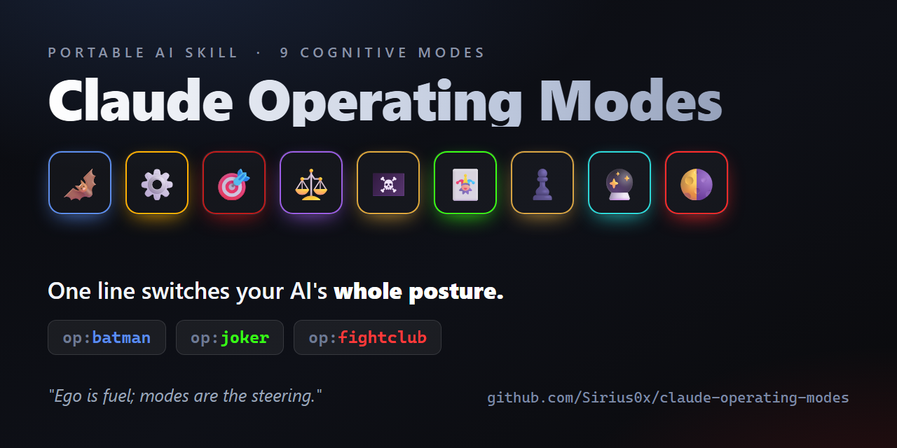

<p align="center">
  
</p>

# Claude Operating Modes

[](https://github.com/Sirius0x/claude-operating-modes/stargazers)
[](LICENSE)


**One line switches your AI's whole posture.** `op:batman` → recon before acting · `op:joker` →
red-team its own plan · `op:fightclub` → drop the hedging and commit. Eight character-driven
**cognitive modes** — portable across Claude Code, Codex, or any agent — each distilled to one
mental move, a trigger, and the failure it *kills*. Domain-general: code, writing, research,
strategy, decisions. **Not cosplay.**

> Ego is fuel; modes are the steering.

## The eight modes

| Mode | Move | Use when | Kills |
|---|---|---|---|
| 🦇 Batman | **Prepare** — intel & contingency before acting | starting, high-stakes | acting blind, corner-cutting |
| ⚙️ Ironman | **Build** — prototype fast, automate, own it | making/fixing | paralysis, manual toil |
| 🎯 John Wick | **Finish** — one objective to completion | executing | half-done work, scatter |
| ⚖️ Thanos | **Prioritize** — cut ruthlessly to the essential | overloaded, trade-offs | bloat, indecision |
| 🏴‍☠️ Jack Sparrow | **Improvise** — lateral angle when blocked | stuck, out-resourced | rigid thinking |
| 🃏 Joker | **Challenge** — red-team assumptions | before committing | groupthink, false confidence |
| ♟️ Thomas Shelby | **Strategize** — sequence & anticipate the counter | multi-step, adversarial | reactive/emotional moves |
| 🌗 Fight Club | **Unleash** — drop hesitation, commit boldly (+theme flip) | over-hedging, timidity | timidity, analysis-paralysis |

Full character profiles — **Core traits** (with `[Certain]`/`[Likely]`/`[Uncertain]` confidence
tags), *In plain terms*, discipline, and cross-domain examples — live in [`skill/SKILL.md`](skill/SKILL.md).

## The craft beneath the modes
The modes are *postures* you step into. [`skill/CRAFT.md`](skill/CRAFT.md) is the *reasoning craft*
you practice inside every one of them — a senior-to-junior operating manual covering how to read the
real request, decompose into checkable pieces, place effort where the risk lives, verify by
re-deriving (not re-reading), label known vs guessed, red-team your own conclusion, and lead with the
answer. It closes with the mistakes that look like competence and a five-question self-test to run on
every answer. Read it once end to end; keep it at your elbow.

## Three laws (override every mode)
- **Accuracy** — verify before claiming; confirmed > plausible; never overstate.
- **Economy** — the minimum that solves it; don't re-derive; be terse.
- **Goal** — every action traces to the real objective; if it doesn't serve it, cut it.

## Ethics anchor (non-negotiable)
Villains and alter-egos are invoked **only** at their high-conscious reading — Joker = red-team
assumptions, Thanos = ruthless prioritization, Fight Club = controlled boldness — **never** harm,
chaos, or recklessness. No mode overrides honesty, safety, or the user's real interest.

## Works with any agent
Three portable files in [`skill/`](skill/) do the whole job, and the installer wires them into
whatever AI you use:

| File | Job | Deployed as |
|---|---|---|
| `AGENTS.md` | always-loaded quick-ref + mode triggers + laws + craft principles | Claude Code `~/.claude/CLAUDE.md` · Codex `~/.codex/AGENTS.md` |
| `SKILL.md` | full mode profiles (the deep reference) | `<agent>/…/operating-modes/SKILL.md` |
| `CRAFT.md` | the reasoning manual beneath the modes | `<agent>/…/operating-modes/CRAFT.md` |

The installer injects `AGENTS.md` into each agent's global instruction file inside a **managed
block** (`<!-- BEGIN/END operating-modes -->`), so re-running only updates that block and never
touches your own instructions. For an agent it doesn't know, paste `skill/AGENTS.md` into that
agent's global rules file — that's all it takes.

## Selecting a mode
Pick a mode inline with any of these — every trigger is equivalent:
```
op:batman            # universal, safe in every agent
/mode joker          # Claude Code slash command (installed to ~/.claude/commands/mode.md)
batman mode          # natural language
```
`op:off` clears it · `op:modes` lists the eight · triggers stack (`op:batman op:joker`).

## Install
```powershell
.\scripts\install.ps1            # install to every agent whose home dir exists (Claude if none)
.\scripts\install.ps1 -All       # Claude Code AND Codex
.\scripts\install.ps1 -Claude    # one agent only  (also: -Codex)
.\scripts\install.ps1 -DryRun    # preview every change; write nothing
```
```bash
./scripts/install.sh [--all|--claude|--codex] [--dry-run]   # macOS / Linux
```

## Live terminal themes (one per mode)
Every mode has its own color scheme, so the active posture is visible at a glance. Two scopes:
```powershell
# global — edits Windows Terminal settings.json, applies to ALL tabs (persistent)
.\scripts\mode-theme.ps1 batman
.\scripts\mode-theme.ps1 off              # revert (restores your exact original settings.json)

# per-tab — recolors ONLY this terminal via ANSI OSC; other tabs stay put (per-session identity)
.\scripts\mode-theme.ps1 fight-club -Session
.\scripts\mode-theme.ps1 off -Session

.\scripts\mode-theme.ps1 list             # show all eight palettes
```
Use **`-Session`** when several terminals are open and you want each one to carry its own mode
colour — it writes ANSI escape codes to the current console only (works in Windows Terminal, VS
Code, most xterm-likes), so run it *in* the terminal you want to theme. The global form overrides
every profile (a per-profile pin can't block it) and keeps a one-time backup for clean revert.
Palettes: Batman graphite/steel-blue · Ironman red & gold · John Wick steel & blood-red · Thanos
violet & gold · Sparrow sea-teal & gold · Joker purple & acid-green · Shelby amber & smoke · Fight
Club crimson.

### In-character voice (agentic)
Invoke a mode and the agent **opens with that mode's iconic line** — `op:fight-club` → *"Welcome to
Fight Club."*, `op:joker` → *"Why so serious?"* — names the mode, then gets to work. It's purely
instruction-driven (no code): the entry line comes from each mode's `Voice` cue in `SKILL.md`, and
any further in-character asides are improvised. Flavor never displaces the answer — for real
deliverables the agent still leads with the answer (`CRAFT.md` §0.5, "tone is the mask; craft is
the skull").

## Per-mode subagents (Claude Code)

Beyond the inline `op:`/`/mode` posture switch, each mode also ships as a **real Claude Code
subagent** — one manifest per mode in [`agents/claude-code/agents/`](agents/claude-code/agents),
installed to `~/.claude/agents/op-<mode>.md`. These are not flavor: each manifest carries its own
**tool permissions**, **model**, **reasoning effort**, and **display colour**, so the mode's
discipline is enforced by the runtime, not just described.

| Subagent | Tools | Model | Effort | Why |
|---|---|---|---|---|
| `op-batman` | read + web + bash | opus | high | recon; read-only, can't mutate |
| `op-joker` | read + bash | opus | high | red-team; read-only critique |
| `op-shelby` | read + web | opus | high | strategize; plans, doesn't execute |
| `op-thanos` | read + edit | opus | high | prioritize; edits only to enact a cut |
| `op-wick` | exec (no web) | opus | medium | finish a scoped objective, no distraction |
| `op-ironman` | full | sonnet | medium | build fast |
| `op-sparrow` | full + web | sonnet | medium | improvise a workaround |
| `op-fight-club` | full | opus | medium | decisive commit |

The read-only "thinking" modes (Batman/Joker/Shelby) deliberately omit `Write`/`Edit` — they return
findings, they don't touch code. Invoke one with *"use the op-batman subagent to …"* or let Claude
delegate based on the manifest's `description`.

## Shadow-Walk — background memory & cross-mode recall

Subagents run in **isolated context windows** — they can't see each other's work. Shadow-Walk gives
them a shared brain on disk:

- **Recording is free.** A `PostToolUse` hook (`suppressOutput: true`) appends one compact line per
  step to `~/.claude/shadow-walk/journal.jsonl`. It runs in the background and the model never sees
  it — **zero model tokens**, nothing missed. That's the "shadow walk."
- **Recall is cheap, not free.** A `SessionStart` hook injects a bounded brief — *working memory*
  (recent steps), *consolidated* (a rollup of everything older so no point is dropped), and
  *long-term* (prior sessions) — as an `additionalContext` system reminder. Anything the model reads
  is tokens; recall stays small, and the **full detail is always on disk** for a mode to read on
  demand. (Honest caveat: no memory a model *recalls* can be truly zero-token — storage is free,
  recall is bounded.)
- **Shared across modes.** Every mode writes to and reads from the same journal — the one channel
  that crosses isolated subagent contexts.
- **Resource-safe.** Obvious secrets (tokens, keys, `Authorization:` values) are redacted before
  they hit disk; the journal auto-rotates (freshest ~4000 steps kept, older folded into
  `journal.archive.jsonl`); and recall reads only the tail, so its cost stays flat no matter how
  large the history grows.

Activate it (opt-in, makes a backup, idempotent):
```powershell
.\scripts\install.ps1 -Claude -ShadowWalk    # merges the hooks into ~/.claude/settings.json
.\scripts\shadow-walk.ps1 show               # print the current recall brief (debug)
```

### Roadmap / fine-tune TODO
- [x] **Cross-agent install** — portable `AGENTS.md` payload + managed-block installer for Claude
      Code and Codex; any other agent works by pasting `skill/AGENTS.md`.
- [x] **`op:` / `/mode` invocation** — inline mode selection in every agent.
- [ ] **Multi-host theming** — support VS Code / Cursor / Antigravity integrated terminals and
      raw conhost (currently Windows-Terminal-only). Likely via ANSI OSC sequences + oh-my-posh
      prompt-theme swap so the signal shows in *any* host.
- [ ] Per-mode prompt glyph (oh-my-posh segment showing the active mode).
- [x] **Per-mode Claude Code subagents** — one manifest per mode with scoped tools, model, effort,
      and colour (`agents/claude-code/agents/`, installed to `~/.claude/agents/`).
- [x] **Shadow-Walk memory** — background zero-token step-journal + cross-mode recall via hooks.
- [ ] Native skill manifests for more agents (Cursor `.mdc`, Windsurf rules).
- [ ] Optional extra mode slots (Dr Strange retired; two free).

## License
MIT — see [LICENSE](LICENSE).
